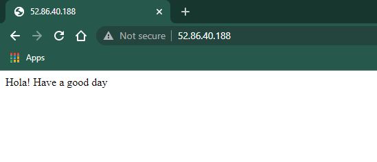

# Automate-webserver-configuration-using-Terraform
<h3>LAMP STACK</h3>
<ul>
  <li>Add your keys</li>
 <li>Add your key_name</li>
 <li>Write the bash script according to your requirements</li>
 </ul>
 <h4>Result</h4>
 
On running above code this is what will get

 
